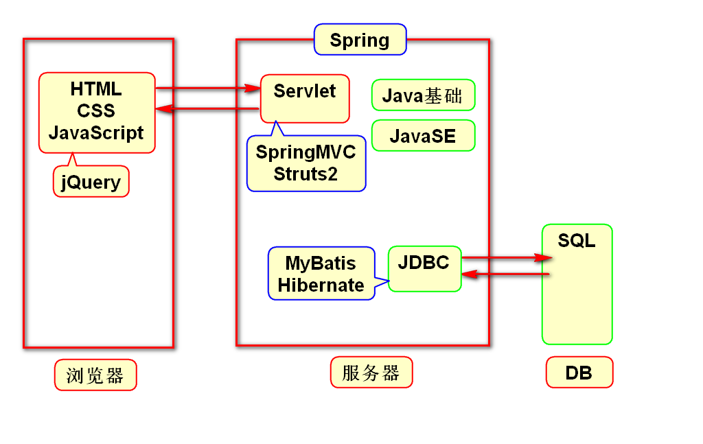
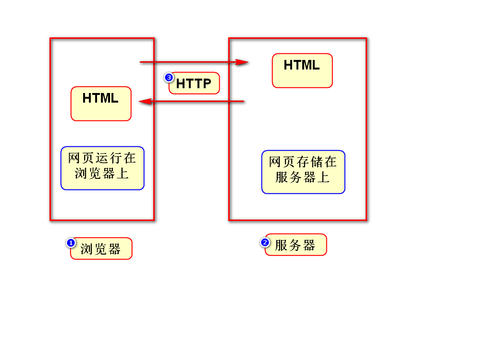
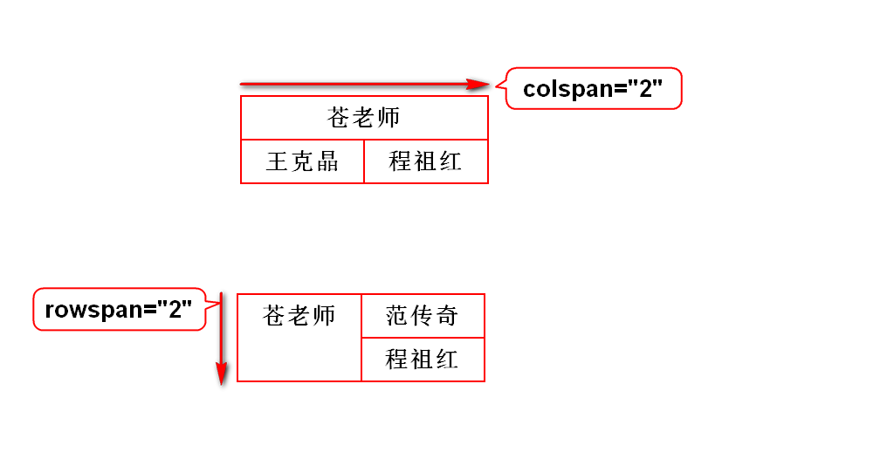
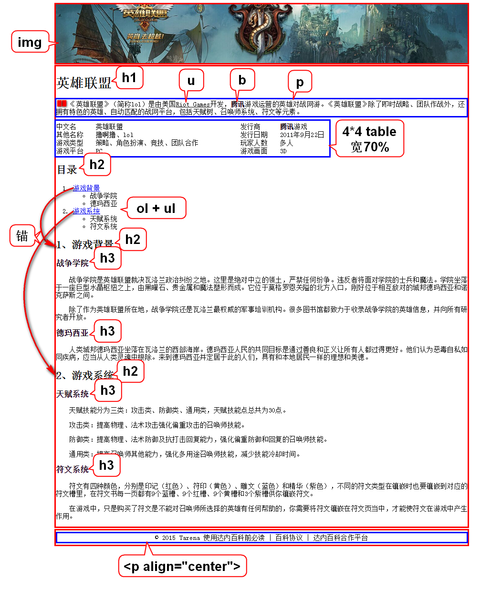

# 自我介绍
- 李洪鹤
- lihh@tedu.cn

# 一.Java体系结构

# 二.课程介绍
## 1.HTML(1.5天)
- 勾勒出网页的结构和内容

## 2.CSS(2.5天)
- 美化网页

## 3.JavaScript(4.5天)
- 让网页呈现动态的数据和效果

## 4.jQuery(1.5天)
- 是一个框架，提高js编程效率

# 三.WEB概述

# 四.XML与HTML对比
## 1.XML
- 可扩展(自定义)标记语言
- 标签、属性、嵌套关系都可以扩展
- 常用来存储数据

## 2.HTML
- 超文本标记语言
- 标签、属性、嵌套关系是固定的(W3C)
- 用来显示数据
- 有些版本的HTML就是用XML规范定义的

> 可以将HTML理解为标签固定的XML

# 五.跨行跨列

# 六.英雄联盟
## 1.分区
- 一般分为3个区域
- 它们的宽都是960,都水平居中
- 为了便于观察div的宽度和位置,给它们加边框

	style="border:1px solid red;width:960px;margin:0 auto;"

## 2.逐个区域写标签

# 补充:创建WEB项目注意事项
## 1.选择JavaEE视图
- 在Eclipse右上角点JavaEE

## 2.选择war包
- 在创建项目的最后一步选择war

## 3.解决报错
- 展开项目，右键点击Deployment，选择Generate