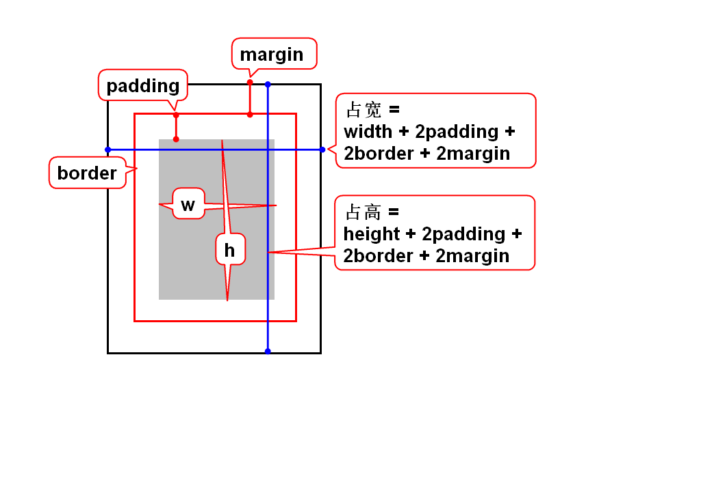
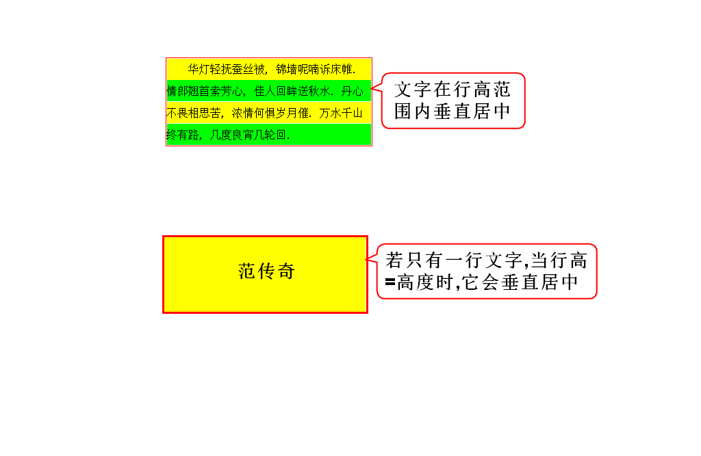

# 一.box

# 二.选择器的优先级
- 元素选择器: 1
- 类选择器: 10
- ID选择器: 100
- .data : 10
- .content>div : 10+1
- .content>.data : 10+10

# 三.行高

# 四.定位
## 1.什么是定位?
- 用来解决元素的排列/摆放问题.

## 2.定位的分类(5)
### 1)默认定位(1)
- 默认情况下,块元素垂直排列,行内元素水平排列.
- 元素默认排列的方式,称之为默认定位,也叫流定位.

> 流:元素有序排列而形成的队伍.

### 2)特殊定位(4)
- 浮动定位:通常解决块元素左右排列的问题.
- 相对定位:可以让元素以自身为目标,产生小的偏移.
- 绝对定位:可以让元素以父亲为目标,产生大的偏移.
- 固定定位:可以让元素以窗口为目标,产生大的偏移.

> 后3种定位十分相似.