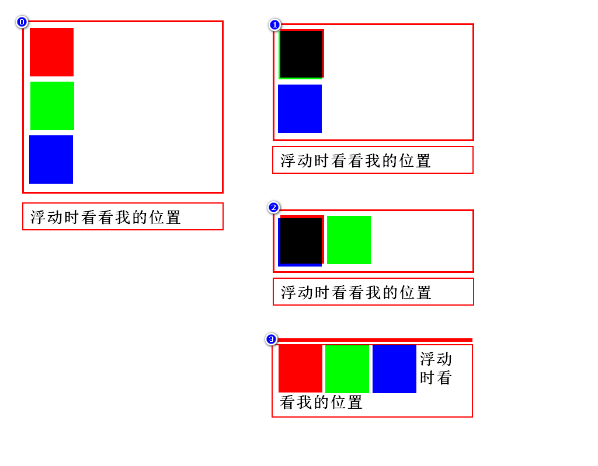
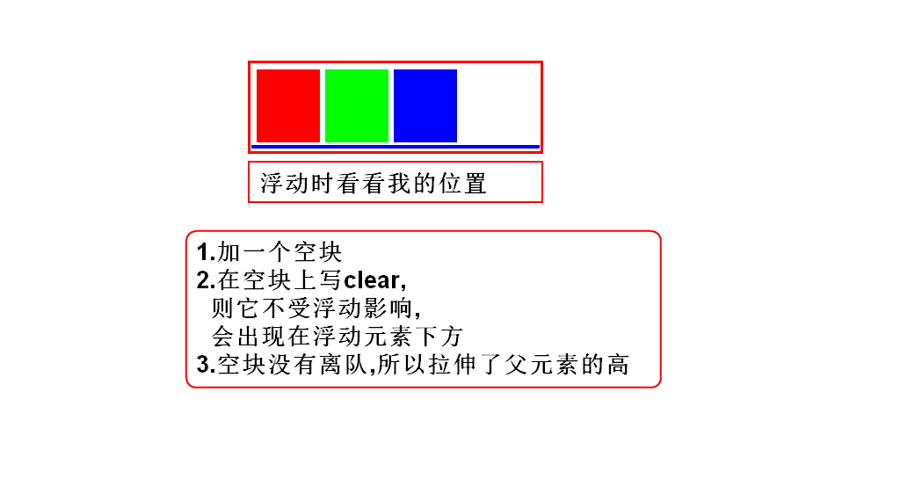
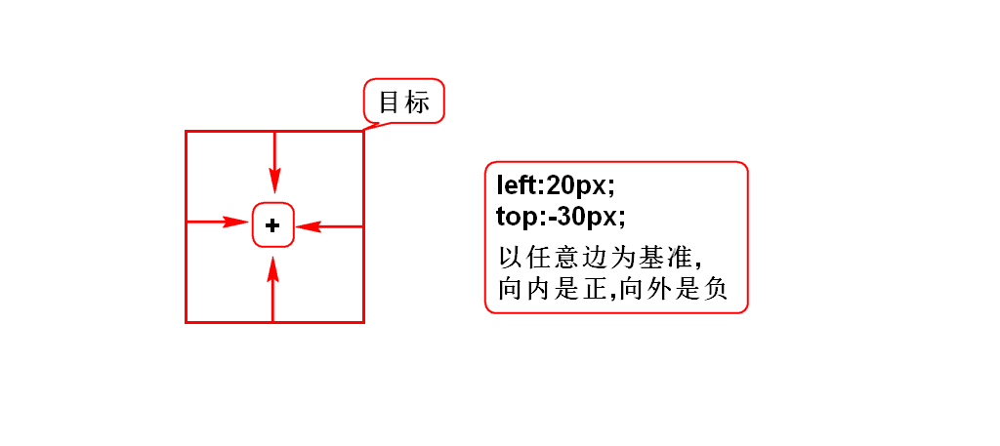
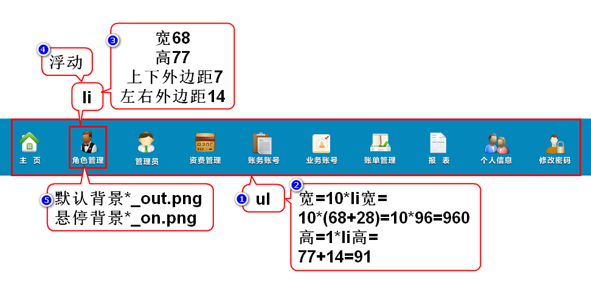

# 一.浮动定位
## 1.简介
- 通常用来让块元素左右排列
- 分类:左/右浮动
- 特点:目标离队(流)
- 步骤:1)目标离队 2)弟弟前进 3)目标去指定位置

## 2.右浮动
- 让块按照倒序左右排列

## 3.左浮动
- 让块按照正序左右排列

## 4.如何消除浮动影响

## 5.照片墙

# 二.相对、绝对、固定定位
## 1.相同点
- 它们设置偏移的方式一样

## 2.不同点
- 偏移时所参考的目标不同

## 3.相对定位
- 以自身为目标,通常偏移量很小
- 目标不离队(只有相对定位不离队)

		position:relative;

## 4.绝对定位
- 以带有position的父辈为目标,产生较大的偏移
- 若父辈都有position,则就近以父亲为目标
- 若父辈都没position,则就远以body为目标
- 目标离队
> 你希望以谁为目标,就在谁上加position

		position:absolute;

## 5.固定定位
- 以浏览器窗口为目标,产生较大的偏移
- 特点:目标离队

> 元素会挂在窗口上保持不动

		position:fixed;

# 三.使用建议
1. 固定定位:看是否要求将元素挂在窗口上保持不动.
2. 相对定位:看是否偏移量很小,是否元素不离队.
3. 浮动定位:看是否要将块左右排列.
4. 绝对定位:超过10秒没想出来.

# 四.管理员查询-5

# 五.元素的显示方式
## 1.块
- 有宽高,垂直排列
- hn,p,ol,ul,div,table,form

## 2.行内
- 无宽高,水平排列
- span,i,em,b,strong,u,del,a,label

## 3.行内块
- 有宽高,水平排列
- img,input,select,textarea

## 4.修改显示方式
- 块: display:block;
- 行内: display:inline;
- 行内块: display:inline-block;
- 隐藏: display:none;

# 六.管理员列表-6
