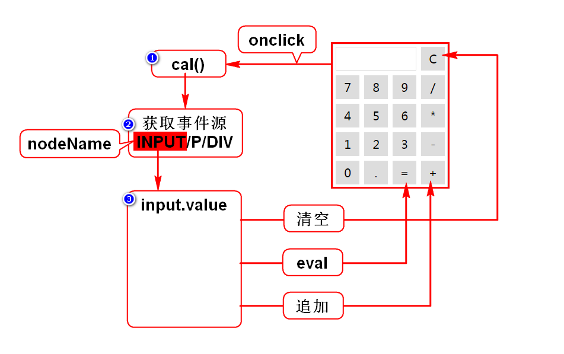

# 一.自定义对象
## 1.直接量对象(JSON)
- {"name":"zhangsan","age":25}
- {}代表一个对象,包含多组键值对.
- 通常key是字符串,value是任意类型的数据.

## 2.构造器(首字母大写的函数)
### 2.1内置构造器
- 特定:Date,Array
- 通用:Object

### 2.2自定义构造器
- 定义一个首字母大写的函数
- 声明需要调用者传入的参数
- 将传入的值保存在此对象上

# 二.事件
## 1.事件概述
### 1)什么是事件
- 就是用户的行为/动作,就是js被调用的时机.

### 2)事件的分类
- 鼠标事件
- 键盘事件
- 状态事件:某条件达成时自动触发.

## 2.事件定义
### 1)直接定义事件
- 优点:简单直观
- 缺点:耦合度高

### 2)动态绑定事件
- 优点:耦合度低
- 缺点:麻烦不直观

### 3)取消事件
- return false

## 3.事件对象
### 1)什么是事件对象
- 在某些案例中需要获得鼠标坐标,键盘按键等信息.
- 这些信息可以从事件对象获得.
- 实际上,在事件触发时,浏览器会创建1个对象,用来封装这些信息.
> 事件对象是由浏览器创建的,封装了事件相关的所有信息.

### 2)如何获得事件对象
#### 直接定义事件时
- 在调用函数时传入关键字event
- 在函数声明时接收此值

#### 动态绑定事件时
- 调用函数时,浏览器会自动传入event
- 在函数声明时接收此值

## 4.事件机制
### 1)冒泡机制
- 事件是由内向外传播的

### 2)停止冒泡
- 利用事件对象的API

### 3)作用
- 用来简化事件的定义

### 4)事件源
- 事件发生的具体位置,事件的来源
- 通过事件对象可以获得事件源

### 5)计算器案例
